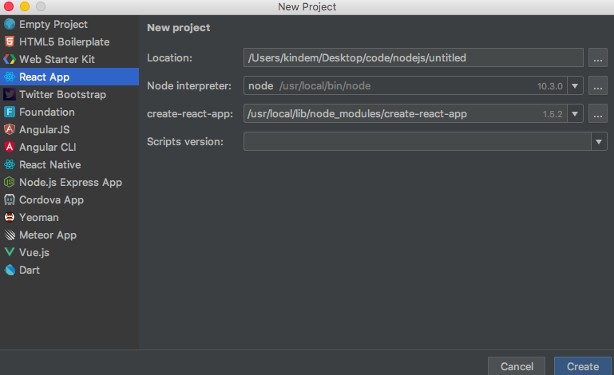
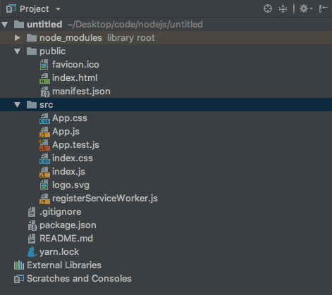
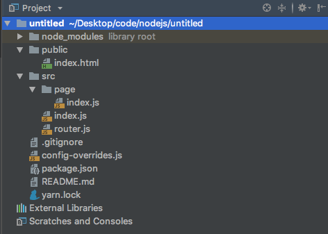
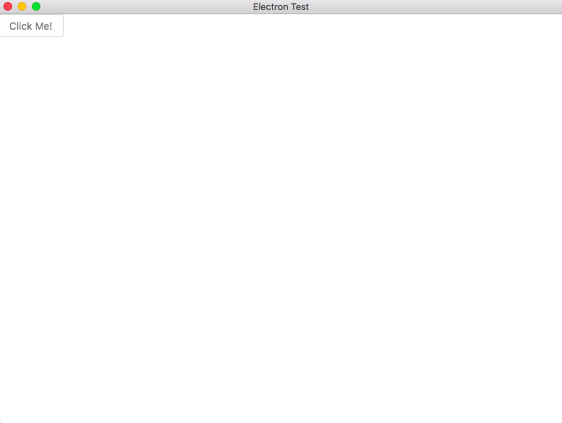

<!--
@key 11
@title 使用 Electron 和 React 构建桌面应用
@date 2018-6-3
@labels JavaScript Electron React
-->

# 🤔 Electron ?
`Electron` 是一个使用 `HTML`、`CSS`、`JavaScript` 构建跨平台桌面应用的框架。

说白了就是用这个框架，你可以在使用前端技术来开发桌面应用，原理是在本地应用上跑一个抽出来的浏览器，浏览器上放你写的页面。

你可能会问 `Electron` 的存在有什么意义，众所周知，前端技术可以让我们轻松写出漂亮易用的界面，如果你尝试过其他的桌面开发技术，想必你也应该知道其他的那些桌面开发工具开发出来的界面有多丑，而 `Electron` 轻松地解决了这个问题。而且从另外一个角度来讲，`Electron` 也可以快速地将你的网站打包成一个原生应用发布。总之，前端技术是构建用户界面最好的选择，而 `Electron` 则为这一思想在桌面的实现奠定了基础。

# ☕ 聊一聊需要用到的前端技术栈
如果你已经对常见的前端技术栈有着一定了解，建议直接跳至下一节，查看 `Electron` + `React` 项目的建立方法。

在开始我们的畅聊之前，先要说一说原始的前端技术。众所周知，传统的前端技术都是使用 `HTML`、`CSS`、`JavaScript` 这御三家来完成开发的，`HTML` 负责页面框架、`CSS` 负责页面样式、`JavaScript` 负责页面动态，这三者各司其职，展现出一个完整美妙的 `Web` 世界。

随着前端的发展，这三者开始出现了这样那样的问题，每一项新前端技术的出现，都是前端的一次飞跃。

### Node.js
`Node.js` 的出现，无非是前端发展的一个里程碑，它的出现，将前端推向了一个新的高峰。

> Node.js 是一个基于 Chrome V8 引擎的 JavaScript 运行环境。Node.js 使用了一个事件驱动、非阻塞式 I/O 的模型，使其轻量又高效。 Node.js 的包管理器 npm，是全球最大的开源库生态系统。

看官网的解释你可能还是一脸懵逼，这么说吧，传统的 `JavaScript` 只能依赖浏览器而运行，而 `Node.js` 则将 `Chrome` 的浏览器引擎抽了出来并加以改进，使得 `JavaScript` 可以脱离浏览器而运行。

而 `npm` 则是 `Node.js` 的一个包管理工具，你可以使用 `npm` 安装这样那样的 `JavaScript` 包，就像 `Python` 的 `pip` 那样简单。

`Node.js` 的出现，使得这样那样的前端开发工具、框架如春笋般涌现，如 `Grunt`、`Webpack`、`React`、`Vue` 等等。而且 `JavaScript` 能够脱离浏览器而运行，也从某种意义上使 `JavaScript` 变成了一个跨平台语言。可以说，`Node.js`，就是如今前端的核心。

### 构建工具
传统的前端 `JavaScript` 开发中，会存在一些问题，最大的问题之一，就是项目文件之间的依赖问题，这一问题时常让前端开发者苦恼不已。

随着 `Node.js` 的出现，人们对 `JavaScript` 的使用方法产生了潜移默化的变化，因为 `JavaScript` 已经成为了一门脱离浏览器而存在的Native语言，人们开始将 `JavaScript` 像其他语言一样看待。

“编译”，这一概念，也自然地被人们引入了 `JavaScript` 的世界，尽管它是一门动态语言。在传统语言中，“编译”这一过程时常是将多个源文件编译并链接成一个可执行文件，“编译”的过程，无非就三个重要点：

* 每一个源文件输出成中间件
* 判断各个中间件之间的相互依赖关系
* 根据依赖关系将中间件打包在一起构成输出

这一思想被运用到 `JavaScript` 之后，人们觉得 `JavaScript` 也应该有“编译”这一过程，用来做以下事情：

* 将每一个 `JavaScript` 文件压缩，删去所有无效字符，输出为中间件
* 判断各个中间件之间的依赖关系
* 根据依赖关系将所有中间件打包成一个输出文件，这个输出文件中具有原来各个 `JavaScript` 中的所有功能，但是体积更小，而且依赖关系被严格限制并且无误

这就是构建工具，你可以把他们认为是 `JavaScript` 的编译器，用于产生更加适合生产使用的输出文件。

当然这只是构建工具功能的一部分，现在的构建工具往往还具有一些更加高级的功能，比如自动流程等。

现在常见的构建工具有 `Grunt`、`Webpack` 等。

### React
`React` 是一个用于构建用户界面的 `JavaScript` 框架，与 `Vue`、`Angular` 这另两大框架相并列。

`React` 的强大之处在于用一种巧妙的思想处理了 `Web` 页面中冗余重复代码多的问题。它能将一些可重用的代码封装成一个个组件，在另外使用的时候，只需要使用组件进行实例化即可。这种思想与面向对象的思想非常相像。所以说，从思想和使用上说，`React`应该是一个非常成熟的框架。

### 前端路由
众所周知，往常Web网站中的路由是交由后端来做的，比如用户访问

```
/match/2
```

这么一个 `url`，本来应该是由后端服务器来接收请求并且做出相应的处理。但是随着 `Node.js` 和构建工具的出现，人们开始想，那么多请求都要交由后端来做岂不是很麻烦，而且从某种意义上，`Web` 网站本身就是一个应用，其中的地址变化处理的逻辑应该在应用内部解决，只有涉及到后端需求的，才交由服务器来处理。

所以，前端路由，应运而生。

前端路由的存在意义就在于将路径逻辑交由前端来处理，而不是后端，这样能让后端专注与真正需要后端资源的请求的处理。

前端路由往往与构建工具、前端界面框架相互配合，构建工具负责将所有文件打包，而前端界面框架往往自己带有自己的前端路由框架，最后打包出来的输出文件，一般只有一个 `inedx.html`、一个 `bunble.js` 和其他的资源文件。一个 `index.html` ，配合 `bunble.js`，就能展现所有页面的内容。

这样既能减少请求量，又符合人们的正常思想，一个网站就是一个应用，像 `Native` 那样，应用内部的逻辑由应用自己处理，真正需要后端支援的时候才发送请求到服务器，让服务器处理，多好。

# 🎉 项目搭建例子: Electron + React + Ant-Design
理论上来说，目前的前端框架都能很好地配合 `Electron` 进行工作，当然你甚至可以使用原生御三家加上 `Node.js` 来进行 `Electron` 应用的开发。

在这里，我以我本人的开发喜好为例，讲解一下使用 `React` 作为前端界面框架、`Ant-Design` 作为 `UI` 库、`Electron` 作为 `Native` 支持的项目搭建。

接下来的操作默认你已经安装了 `Node.js`。

### 安装Electron
首先，当然需要安装 `Electron` 了，进入 `cmd`：

```
npm install -g electron
```

如果无法安装尝试为 `npm` 设置代理。

我这里使用的是全局安装 `Electron`，原因是因为 `Electron` 包比较大，而且运行 `Electron` 这一操作是可复用的，所以我认为全局安装 `Electron` 更加合适，这里只需要安装一次 `Electron`，在哪里都能使用。

### 创建React项目
接下来用于我们需要使用 `React`，所以一个在项目中启用 `React` 支持也是必不可少的，创建一个真正可用的 `React` 项目环境还是比较复杂的，这里推荐直接使用 `Facebook` 官方的 `create-react-app` 工具，使用它可以直接创建一个 `React` 项目。

使用 `npm` 全局安装它：

```
npm install -g create-react-app
```

安装完 `create-react-app` 之后，我建议使用 `WebStorm` 来创建项目，因为 `WebStorm` 是现在最好的 `JavaScript` `IDE`，当然如果你一定要使用命令行来创建我也没意见，只是 `WebStorm` 可以方便你之后的开发。

你安装 `create-react-app` 成功之后，就能直接在 `WebStorm` 中使用集成创建项目的方法创建一个 `React` 项目，创建项目的时候选择到 `React App` 一栏，`WebStorm` 会自动识别到 `create-react-app` 以供你创建项目：



第一栏是你项目的位置，自己选一个并且取好项目名即可，第三栏如果报红色错误则说明你的 `create-react-app` 工具没能被识别或者没能被安装，请自行检查。

确认无误之后创建项目即可，创建项目之后将会自动执行指令完成之后的事情。

等下面的操作全部完成之后，你可以看到项目目录像这样：



这时候推荐再安装一个额外的包管理工具 `yarn`，这个时候我们可以不用使用自己的 `cmd` 或者终端了，而可以直接使用 `WebStorm` 自带的集成终端，这个终端跟原生终端( `cmd` )一样，但是会自动进入项目目录下。看上方的菜单：`View` -> `Tool Windows` -> `Terminal` 即可调出，在集成终端中输入：

```
npm install -g yarn
```

安装 `yarn`，以后我们将使用 `yarn` 来进行包管理而不是 `npm`，因为 `yarn` 有着更多优点。

这时候你可以使用：

```
yarn start
```

打开调试服务器，在弹出的网页中你可以直接看到 `React` 的欢迎页面，这些就是 `public` 和 `src` 目录下的文件所做的努力。

但是接下来，我们需要把他们全部删除，因为我们自己的页面根本不需要它。注意是删除 `public`、`src` 文件夹下的所有文件，而不是删除这两个文件夹！

### 引入Ant-Design
当删除完成之后，我们就可以引入 `Ant-Design` 了，在集成终端中输入：

```
yarn add antd
```

这样一来我们就在项目中引入了 `Ant-Design`，但是我们还不能直接使用它，我们还需要做一些处理。

安装 `react-app-rewired`，这是一个自定义配置 `react` 项目的工具：

```
yarn add react-app-rewired --dev
```

修改根目录下的 `package.json`：

```
# /package.json

"scripts": {
-    "start": "react-scripts start",
-    "build": "react-scripts build",
-    "test": "react-scripts test --env=jsdom",
+    "start": "react-app-rewired start",
+    "build": "react-app-rewired build",
+    "test": "react-app-rewired test --env=jsdom",
  }
```

这样做的目的是让 `start`、`build`、`test`三个命令使用我们自定义的 `React` 配置而不是使用默认的。

然后在项目根目录下创建一个 `config-overrides.js`，用于书写自定义配置：

```
# /config-overrides.js

module.exports = function override(config, env) {
  return config;
};
```

接下来需要安装 `babel-plugin-import`，这是一个按需加载代码、样式的 `babel` 插件：

```
yarn add babel-plugin-import --dev
```

修改 `config-overrides.js`：

```
# /config-overrides.js

+ const { injectBabelPlugin } = require('react-app-rewired');

  module.exports = function override(config, env) {
+   config = injectBabelPlugin(['import', { libraryName: 'antd', libraryDirectory: 'es', style: 'css' }], config);
    return config;
  };
```

这样一来，`Ant-Design` 就配置完了

### 添加路由
这时候在 `public` 下新建一个 `html` 文件，像这样：

```
# /public/index.html

<!DOCTYPE html>
<html lang="en">
<head>
    <meta charset="UTF-8">
    <title>Electron Test</title>
</head>
<body>
    <div id="root"></div>
</body>
</html>
```

这个文件将来将会作为 `Electron` 的入口网页文件。

安装前端路由 `react-router-dom`：

```
yarn install react-router-dom
```

安装完成之后，在 `src` 目录下新建一个入口 `js` 文件 `index.js`、一个路由组件文件 `router.js`，再创建一个文件夹叫 `page` 用于存储页面组件文件，里面再建立一个文件叫做 `index.js`，用于存储首页组件，这时项目结构如下：



这时候我们先修改 `/src/page/index.js` 文件，在里面写一个首页的组件：

```
# /src/page/index.js

import React from 'react';
import { Button } from 'antd';

export class IndexPage extends React.Component {
    render() {
        return (
            <div>
                <Button>Click Me!</Button>
            </div>
        );
    }
}
```

然后打开路由文件 `/src/router.js`，写路由组件：

```
# /src/router.js

import React from 'react';
import { HashRouter, Route, Switch } from 'react-router-dom';
import { IndexPage } from "./page";

export class MainRouter extends React.Component {
    render() {
        return (
            <HashRouter>
                <Switch>
                    <Route exact path={'/'} component={IndexPage}/>
                </Switch>
            </HashRouter>
        );
    }
}
```

以后添加新页面只需要在 `page` 中写一个新的页面组件文件，然后修改路由文件，在 `Switch` 中添加 `path` 与组件的对应关系即可。

接下来再在 `/src/index.js` 这一入口文件中渲染路由组件：

```
# /src/index.js

import React from 'react';
import ReactDom from 'react-dom';
import { MainRouter } from "./router";

ReactDom.render(
    <MainRouter/>,
    document.getElementById('root')
);
```

这样一来，就算成功地写了一个框架了，以后添加新页面只需要按照规则添加即可。

可以尝试使用：

```
yarn start
```

来运行调试服务器查看页面是否显示正常。如果看到这样的页面，上面有一个 `Antd` 样式的按钮：


那么恭喜你，至少你到这一步之前的都成功了，如果没有成功，仔细回看步骤，看是否有做错的地方。

### 使用Electron运行页面
既然页面在不使用的 `Electron` 的时候能够正常运行，那么应该在 `Electron` 上面跑一跑看一下效果了。

在 `/package.jso` n中添加一条脚本，并且修改少量配置,用于执行 `Electron` 应用：

```
# /package.json

  "scripts": {
    "start": "react-app-rewired start",
    "build": "react-app-rewired build",
    "test": "react-app-rewired test --env=jsdom",
    "eject": "react-scripts eject",
+  "estart": "electron ."
  }

  ...

+  "main": "main.js",
+  "homepage": ".",
+  "DEV": true
```

在项目根目录下创建一个 `main.js`，用于作为 `Electron` 应用的入口：

```
# /main.js

const { app, BrowserWindow } = require('electron');

// 浏览器引用
let window;

// 创建浏览器窗口函数
let createWindow = () => {
    // 创建浏览器窗口
    window = new BrowserWindow({
        width: 800,
        height: 600
    });

    // 加载应用中的index.html文件
    window.loadFile('./build/index.html/');

    // 当window被关闭时，除掉window的引用
    window.on('closed', () => {
        window = null;
    });
};

// 当app准备就绪时候开启窗口
app.on('ready', createWindow);

// 当全部窗口都被关闭之后推出
app.on('window-all-closed', () => {
    if (process.platform !== 'darwin') {
        app.quit();
    }
});

// 在macos上，单击dock图标并且没有其他窗口打开的时候，重新创建一个窗口
app.on('activate', () => {
    if (window == null) {
        createWindow();
    }
});
```

从此，每次运行 `Electron`，只需要输入

```
# 运行构建指令
yarn build
# 使用electron运行构建出来的Web项目
yarn estart
```

即可看见效果，像这样：



像平时写 `Web` 项目一样写原生 `UI` 吧，Enjoy!
