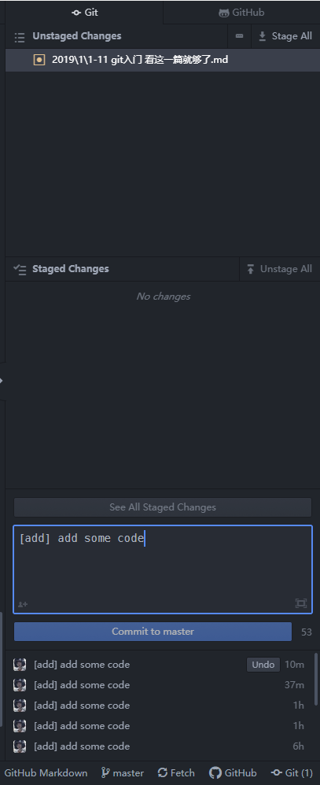

<!--
@key 15
@title git 入门，看这一篇就够了
@date 2019-1-11
@labels Git
-->

# 🤔 何谓 git
在说 `git` 之前，先说一说什么是 `VCS`。`VCS` 的全称是 `Version Control System`，即 `版本控制系统`。`VCS` 的主要目的是按照时间轴的模式管理工作区(你可以理解成项目文件夹)中文件的变化。

传统文件系统是直接保存所有文件的，在没有做任何备份的情况下，更改了就是更改了，删除了就是删除了，你没法跟踪每一个文件的变化。这样的好处就是文件占用容量小，不需要额外的容量来保存文件的其他元信息，而只需要保存文件本身。弊端则是一旦文件被更改/丢失，就没了。

对于**代码**一类的重要文档资源，我们很强调其版本的变化以及可追踪性，由于代码本身占用空间比较小，我们宁可牺牲一些额外空间来保证其完整性和可追踪性。`VCS` 就是实现这样一个功能的一类系统的统称，在 `VCS` 管理下的文件，将会被跟踪，被跟踪文件/文件夹的所有变化(增删改)都会以增量的形式被记录，换而言之，`VCS` 在初始化之后，保存的是文件的变化和文件本身，这样的话，只要用户选择提交，日后可以任意恢复到之前的任何一个时间节点(版本)。

`git` 就是一种 `VCS`，当然其他的 `VCS` 还有 `SVN` 等，`git` 与他们的区别在于 `git` 是分布式的，诸如 `SVN` 一类的集中式 `VCS` 需要有一个 `VCS` 仓库服务器统一管理，任何更改都需要直接提交到服务器上，`git` 与之的区别是 `git` 的远程仓库可以在其他地方拥有副本，副本可以任意演化，只要满足一定条件，多个副本可以合并，这也是 `git` 为现代开源社区做了铺垫的原因。

# 🎉 安装 git
`Linux` 和 `Mac OS` 这一类类 `Unix` 系统的安装都非常简单，在系统的软件镜像源中都已经附带了 `git` 的二进制包，直接安装即可：

```
# Ubuntu/Debian系 Linux
sudo apt-get install git
# Mac OS
sudo brew install git
```

而 `Windows` 上的 `git` 有一些特殊，由于原生的 `git` 是依附 `Bash/Shell` 终端而存在的命令行应用，在 `Windows` 上并没有 `Linux/Mac OS` 等系统的 `Shell`，所以官方使用 `Cygwin` 模拟了 `Linux` 上的 `Shell` 环境，并将 `git` 置于容器中运行，我们称之为 `git bash`，当然官方也提供了 `git` 的 `GUI` 版本和 `Windows CMD/Power Shell` 支持，只要你安装了 `Windows` 上的 `git` 软件包，使用任意一种形式的运行方式都是可以的。

地址在这里：[Git-SCM](https://git-scm.com/)，相信你能找到下载地址，下载完成之后，选好安装位置，一路`next`就行了，这里改了设置可能还会让你陷入一些奇妙的组件缺失问题中，直接用默认设置最简单。

安装完成后，你可以在任意位置右键使用 `git bash`，这个操作将会打开一个虚拟终端，供你使用 `git`，当然，直接在 `Windows` 中的 `CMD` 或者 `Power Shell`，也能输入 `git` 指令进行操作。而类 `Unix` 系统中，直接在终端中输入 `git` 指令即可。

# 🔨 配置 git
在安装 `git` 后，你需要先配置你的姓名和邮箱，这两个信息会在每一次提交操作中存留，在 `git` 终端中按照如下格式输入即可：

```
git config --global user.name "John Kindem"
git config --global user.email "kindem@outlook.com"
```

这一步是必要的，没有提交者身份是无法提交更改的，在某一些 `git` 仓库网站(比如 `github` )上，你的这两个信息还会被用于进行身份验证。

当然这两个信息并不是 `git` 的登录账户信息，你可以理解为是你这一台电脑上的笔名，你大可随意写，没关系，真正负责 `git` 身份认真的是用户名密码组合或者 `ssh key`。

这两种验证方式你可以任选其一，如果你要使用 `git` 用户名和密码进行验证，那么直接进行具体的操作即可，比如 `git clone`、`git push` 等，站点那边将会自动询问你的用户名和密码，你按照你在 `git` 网站上的账号密码输入即可。但是这种方法的缺点是每一次进行操作都会询问你用户名和密码，你可以使用这么一条配置命令，让 `git` 自动记住你的登录凭据，只要登录一次，以后 `git` 就会自动为你进行登录验证，无需再输入用户名和密码：

```
git config --global credential.helper store
```

当然你也可以使用 `ssh key` 的方法进行验证，他的原理是在一台电脑上使用生成器生成一个 `ssh key`，然后将这个 `ssh key` 填入 `git` 网站中个人设置部分的 `ssh key` 部分，当你向这个网站进行 `git` 操作时，可以自动为你验证。

生成 `ssh key` 的方法如下：

```
ssh-keygen -t rsa -b 4096 -C "kindem@outlook.com"
```

这个邮箱需要填写你 `git` 网站中的账户邮箱，生成之后它会询问你存放位置和一些额外信息，通常情况下一路回车就行，弄完之后，你可以在

生成完毕之后你可以使用如下指令查看生成的公钥：

```
cat ~/.ssh/id_rsa.pub
```

将公钥整个复制到 `git` 网站的公钥库中即可。

另外，如果你在 `Linux` 上使用，`git commit` 触发的默认编辑器是 `Mono Editor`，你可以使用如下指令将其更改成我们所更熟知的 `vim`：

```
git config --global core.editor vim
```

# ✨仓库/提交
**仓库** 是 `git` 管理的基本单位，简单来说，一个仓库就是一个文件夹，文件夹内不但保存了文件本身，还有 `git `的工作信息，一般以 `.git` 隐藏文件夹的形式存在于文件夹中，不需要深究 `git` 的工作原理，只需要知道，如果把 `.git` 文件夹删除了，就相当于毁坏了一个仓库。

所谓 **仓库初始化** ，指的是将一个普通的文件夹变成一个 `git` 仓库，具体操作如下：

```
git init
```

当输入这条指令之后，`git` 将会把当前目录变成一个 `git` 仓库，在完成初始化之后，即可开始进行一些其他的 `git` 操作。

在 `git` 初始化完成之后，仓库内的所有增删改操作( **更改** )都会被记录下来( **跟踪** )，例如新增一个文件/文件夹，删除一个文件/文件夹等，这里的更改指的是，相对于上一次 **提交** 的变化增量。可以把 **提交** 理解成一个记录点，一次 **提交** 将会记录自上一次 **提交** 一来的所有变化。

如果进行一次提交呢？最简单的办法是在仓库目录下使用：

```
git add .
git commit
```

二连进行提交，这样项目下的所有 **更改** 都会被储存，当然如果你需要部分提交的话可以对部分文件分别进行 `git add` ，将其暂存，然后再提交，一次提交所有的办法固然是最简单也是最省力的。

另外，每一次提交，都需要有一个备注信息，这个备注信息将会在提交后自动让你填写，这个备注信息是你可以任意写的，但是为了日后看起来舒服、管理也方便，建议使用很多开源项目推荐的标签加内容的备注方法来备注每一次提交，像这样：

```
[add] add a new source file for index page
```

# ☁️ 远程/本地协作
之前说过，`git` 是一个分布式的版本控制系统，他最大的优点就是，一个远程仓库可以在很多台计算机上存在不同的本地仓库副本，这些副本可以单独演化，并且在日后可以遵循某种规则进行合并，就像这样：

```  
        clone                new code
     /-------- Cloned Repo ------------>\
    /                                    \
Repo ---------------------------------------> Repo
```

想象一下，传统的集中式 `VCS` 中，团队开发中如果一个人提交了错误的代码，整个团队的代码都将无法运行，而使用 `git`，每一个开发者都可以 `clone` 一份属于自己的本地 `git` 仓库，然后他们可以在自己的 `git` 仓中开发、测试自己的新功能，在确定无误之后，再讲自己的仓库与原来的仓库合并，这样就可以保证开发者之间能够协作但不互相影响，这就是 `git` 的魅力，同时这也是 `git` 支撑起了开源社区半边天的原因。

要获得一份远程仓库副本，就要使用到 **克隆** 操作，像这样：

```
git clone https://github.com/safdsaf/sadsag.git
```

后面的地址即 `git` 仓库的 `git` 地址，在 `git` 托管网站对应的仓库页面上可以获取到，当然你也可以使用 `ssh` 形式的地址，一样的。当克隆无误并且完成后，你可以在使用 `git clone` 指令的目录下看到一个新的文件夹，以仓库名命名，这就是克隆下来的仓库。

在很多网站上，往往还提供了下载源码包的选项，理论上来说这与 `git clone` 类似，但是我更推荐在任何情况下都使用 `git clone`，因为 `git clone` 会自动添加一条远程分支指向远程仓库源地址，这样的好处是日后你 `push` 的时候可以无需手动配置远程分支地址。

在 `clone` 了一个仓库之后，你可以在本地任意修改、提交，但是你的更改并不会同步到远程仓库，当你确定需要将自己一段时间的努力同步到远程仓库时，你就可以使用：

```
git push
```

指令，将所有的更改同步到远程仓库，这里要注意的是，`git push` 成功地条件是，你的提交与远程仓库在同一时间段的其他提交无冲突，举个栗子，你和同事同时 `clone` 了一份远程仓代码，然后你和同事同时对同一文件的不同位置进行了修改，那么你们的提交就有冲突。如果遇到冲突，需要进行冲突合并，这一部分就很复杂了。我建议，最简单的办法是，原则上，永远不要和同事在同一时间段修改一个文件，换而言之，一套良好的代码结构，也不应该允许多个人同时协作修改同一文件。

`git push` 这一条指令的默认推送分支是 `remote origin` 分支，如果你是用 `git clone` 的方式新建的本地仓，那么久不用在手动配置了，所以我推荐的项目创建方法是，当你需要用远程仓管理，第一件事情不是建本地仓，而是在网站上先建一个空项目，当然也可以使用 `README.md` 进行初始提交，建完空项目之后直接在本地 `clone` 一份，每一次提交就 `git push` 一次，简单又不容易出错。

如果你非要在本地建本地库然后手动配置远程分支源，那么你可以这样：

```
git remote add origin https://gjthub.com/sadsaf/asdsag.git
```

**同步** 永远都是两个状态，上传与下载，上传更改是 `push`，那么下载更改就是 `pull`，这没什么好说的，直接：

```
git pull
```

即可，这条指令也要保证你的文件变化没有冲突，最简单的避免冲突的方法是，一旦更改，必定提交，提交之前先 `pull` 一次，永远不要在同一时刻( **指两次提交间的区间** )在不同的主机上修改同一文件，谨记这几条，你基本上是遇不到冲突的，就算遇到了冲突，也一定是可合并的冲突，不是严重冲突，使用 `git` 的新手最容易遇到严重冲突然后不知道合并，导致弃坑，其实你掌握了一定方法，冲突基本上是可以 `100%` 避免的，用习惯了，`git` 将会是你代码的好伴侣。

# 🔌 分支
分支的概念其实也没网上说的那么玄乎，最简单的理解办法，就是你可以吧分支理解为一个仓库的分仓库，在不同的分支下仓库可以独立发展，分支也能在没有冲突的情况下进行合并。最极端的情况下(就像我们自己玩的小项目)，一个仓库就只有一个分支，即 `master` 分支。

分支的实际作用是，在同一个仓库中划分出一些不同的域，比如我开发分支可以独立发展，测试分支也可以独立发展，当我测试分支完全测试通过了，我可以把测试分支合并到开发分支中去，理解一下应该不难，分支在个人开发中用的还算比较少，但是在大型项目中分支用处很大。

远程分支即你本地仓库在远程的对应分支，一般是本地的 `master` 对应远程的 `origin` 这样子。具体要了解分支可以看看廖雪峰老师的 `git` 教程或者官网的 `git` 教程都行。

# 🙄 GUI 集成的 git
其实不少编辑器 / `IDE`，都是集成了 `git` 模块的，诸如 `Atom`、`Visual Studio Code`、`Visual Studio`、`JetBrain IDE`一类的，在这些开发软件中，你其实可以点点点就完成 `git`的所有操作，包括 `clone`、`push`、`pull`，基本上全部点一遍就能会用，总之就是想说，在使用有集成 `git` 功能的开发软件开发的时候，就不要再另外开一个终端傻傻地敲指令了，可以直接在 `GUI` 中完成 `git` 操作。

举个栗子哈：



# 🍉 github
`github` 是一个著名的同性恋交友网站(滑稽)，大家应该都听过这个伟大的开源社区，`github` 除了是一个 `git` 代码托管网站外，还提供了一系列有助于开源社区发展的功能，最典型的就是：

* `fork`
* `issue`
* `pull request`

所谓 `fork`，指的是分流、下游的意思，当你 `fork` 一个仓库，你可以在你自己的远程仓库列表中复制一份别人的仓库(注意是远程仓库不是本地仓库)，也就是说 `fork` 的功能就是直接把一个别人的仓库变成你的，但是这个仓库会继承一些上游信息，也就是说别人也能看到你这个仓库不是原创的。

`fork` 的功能有很多，最简单的，你可以把别人的代码 `fork` 过来自己看、自己改着玩、自己测试等等，捣鼓坏了删了再 `fork` 一份就行，这也是为什么 `github` 在 `fork` 的过程中是一个用餐的动图的原因。

往更深层了说，`fork` 还可以配合 `pull request` 一起使用，`fork` 是你直接将仓库复制，然后自己进行改动，这一操作是无需授权的，但是如果你需要再将你改的代码回写回去，那么你就需要用到 `pull request` 了，当你向你 `fork` 的仓库的上游仓库发起一个 `pull request` 的时候，那个仓库的管理员将收到一条信息，你需要选择你回写的分支，如果确认分支无冲突可以合并，仓库管理员则可以同意，同意之后你的代码将会回写进那个上游仓库，你也可以自豪地说你为开源社区做出了贡献，当然那个上游仓库的提交记录也能看到你这一份贡献。

至于 `issue`，则可以简单理解为提议/议论一类的东西，发两个就懂了。

这里还要提一句的是两样东西：
* `gitignore`
* `Marddown`

这两样东西虽然不是 `github` 的原创，但是在 `github` 中被大量使用，要融入开源社区，或多或少还是要了解一点。

`gitignore` 是一种文件格式，它是一个隐藏文件，文件名为 `.gitignore`，将其放在 `git` 仓库的根目录下，`git add` 的时候将会自动把里面描述的文件/文件夹忽略掉，这样一个功能是很有实用价值的，比如很多 `IDE` 都会在项目目录下弄一个 `IDE` 的配置文件夹，比如著名的 `.idea`，`.vs`等，再比如 `npm` 的依赖文件夹 `node_modules`，这一类文件夹存放的不是源码，所有我们大可将其直接忽略掉，我们只需要在 `.gitignore` 文件中这样写即可：

```
# JetBrain IDE Config Folder
/.idea

# Node.js Modules Folder
/node_modules
```

语法其实很简单，就是项目路径相对路径而已，`#`开头的行是注释行

而 `Markdown` 是一种标注型文档格式，用一些特殊的标注来代表不同的文本格式，虽然不是所见即所得，但是这一格式在 `github` 上被广泛使用，如果直接在 `github` 上浏览 `.md` 源文件，`.md` 文件会被直接转义成预览模式，就像看文档一样，所有 `Markdown` 常常被用于写 `github` 上的文档、博客等，每一个仓库下的 `README.md` 描述文件也是 `Markdown` 格式的，语法也不难，可以学一哈。
