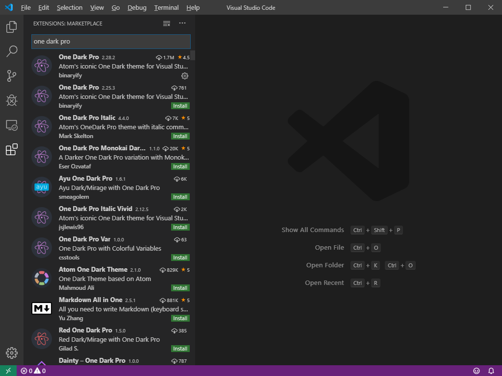

<!--
@key 19
@title 用 Visual Studio Code 打造优雅的 Markdown 编辑环境
@date 2019-10-12
@labels VSCode Markdown Tips
@description 使用 Visual Studio Code + Markdown Preview Enhanced 可以创造一套优雅的 Markdown 编辑环境，用这套环境写出好看的文档吧！
-->

# 🍜 预备知识

`Visual Studio Code (VSCode)` 是微软推出的一款开源编辑器，使用 `Electron` 打造，与 `Atom` 齐名，不过随着 `Atom` 社区的渐渐缩小，`VSCode` 的影响力开始越来越大了。`VSCode` 内置了 `Markdown` 语言及预览的支持，很适合用于编辑 `Markdown` 文档。

`Markdown` 是一种标记语言，可以在写文档的同时，通过添加一些特殊标记，快速完成文档的排版，很多程序员都喜欢使用 `Markdown` 来写文档，另外，`github` 也使用 `Markdown` 作为仓库 `README` 的标准语言，可以说是写技术文档的首选方案。关于 `Markdown` 的语法，可以在这里学习：[菜鸟教程 - Markdown 教程](https://www.runoob.com/markdown/md-tutorial.html)

# 🍨 搭建环境

首先当然是下载安装 `VSCode` 啦，官网在 [Visual Studio Code](https://code.visualstudio.com/)，一路安装即可，完成安装之后，打开 `VSCode` 界面如下:


为了更好的编辑体验，我们可以先安装配色 `One Dark Pro`，这款配色沿袭自 `Atom`，是公认的比较舒服的几套配色之一，在侧边栏中的插件栏中搜索 `One Dark Pro` 并下载:



完成安装之后，在顶部工具栏中依次点击 `File -> Preference -> Color Theme`，选择 `One Dark Pro`，即可看到效果：


之后我们需要配置一款舒适的字体，这里推荐 `Fira Code`，下载地址如下：[Fira Code](https://github.com/tonsky/FiraCode)，下载 `TTF` 字体并安装即可，之后在 `File -> Preference -> Settings` 中依次更改这几项：

* `Font Size`: `14`
* `Font Family`：`'Fira Code', Consolas, 'Courier New', monospace, 微软雅黑`
* `Font Ligatures`：`true`

完成这几步之后，即可安装我们的核心插件 `Markdown Preview Enhanced`，参考之前的步骤：


这样就完成了 `Markdown` 写作环境的搭建。

# 🍳 写作示例

如果要开始写作，首先要创建一个文件夹作为工作区，在想要的位置创建一个项目文件夹，这里我建的项目名叫 `MarkdownProject`：


右键 `MarkdownProject` 并点击 `Open With Code`，这样可以直接用 `VSCode` 打开项目文件夹。

点击如下两个按钮可以创建文件和文件夹：


我们在项目根目录下创建一个目录叫做 `img`，接着在根目录下创建一个文件 `xx.md`，`img` 目录的作用是在本地存放图片，而 `.md` 文件则是文档的源文件，完成创建之后，即可在其中使用 `Markdown` 语法进行写作了：


如果需要添加图片，推荐的做法是将图片存放到 `img` 路径下，并在 `.md` 文档中使用相对路径的形式引用：

```markdown

```

编辑的同时可以点击：


注意不要点击另外一个类似的按钮，红框中的按钮是 `Markdown Preview Enhanced` 插件提供的优化版预览，而另一个是 `VSCode` 原生提供的预览，效果不敢恭维，点击预览之后，即可在书写文档的同时看到效果。

最后如果需要导出文档，则只需要在预览栏中点击右键：


这里有很多种支持的格式，其中推荐使用 `eBook` 中的 `HTML` 格式，这样导出的文档不需要将图片打包一起带走，而是直接将图片使用内置编码放在文档中。另外，如果导出成 `PDF` 的话可能会出现分页问题，由于 `Markdown` 本身的原理就是转换成 `HTML` 渲染，再加上 `Markdown` 也是流式文档，`HTML` 将会是最好的导出格式。导出的文档可以在 `.md` 的同路径下找到。

# 🍣 怎么样写出漂亮的技术文档

关于怎么写出漂亮的技术文档，个人随便说几句自己平时使用 `Markdown` 写文档的心得吧：

---

### 在中文中插入英文的时候，永远使用内联代码块，并使用空格分割

对比一下这两段文字吧：

* 我觉得这样写还挺ok呀
* 我觉得上面写的不 `ok`呀

在技术词汇比较多的时候，下面的写法明显更加醒目，而且这样写能保证整段文字不会过于单调。

---

### 不要滥用代码块

大段大段的代码容易使人视觉劳累，而且过于单调，使用代码块的地方推荐插入的代码不要太长，并且配上讲解，切忌不要大段大段直接引用代码，举例：

```javascript
let numbers = [1, 2, 3];
```

巴拉巴拉

```javascript
numbers.forEach(number => { console.log(number); });
```

巴拉巴拉

---

### 善用特殊格式

类似的，**加粗**，*倾斜* 等格式适用于让部分文字更加醒目，不要大段大段地使用这类格式，**要是一整段都都是重点，不就相当于没重点嘛**，看看下面这段：

**谁说的 “一整段都都是重点，不就相当于没重点嘛”，快出来挨打，我就是加粗一整段，你还能觉得我丑不成嘛？？？**

---

### 使用 Emoji 让文档变得俏皮

有时候，加几个 `emoji`，可以让文档一下子变得可爱起来 😜，你觉得呢？

在 `Windows` 上，可以切换成微软输入法或者 `ENG` 输入法，然后使用 `Win + 。` 来快速输入 `emoji`：


超级好用的小窍门！

# 😎 最后说几句

写得多才能写得好，多写文档，养成良好的习惯，文档写的越漂亮，才越会想写 🤣。希望各位能越写越好 👏