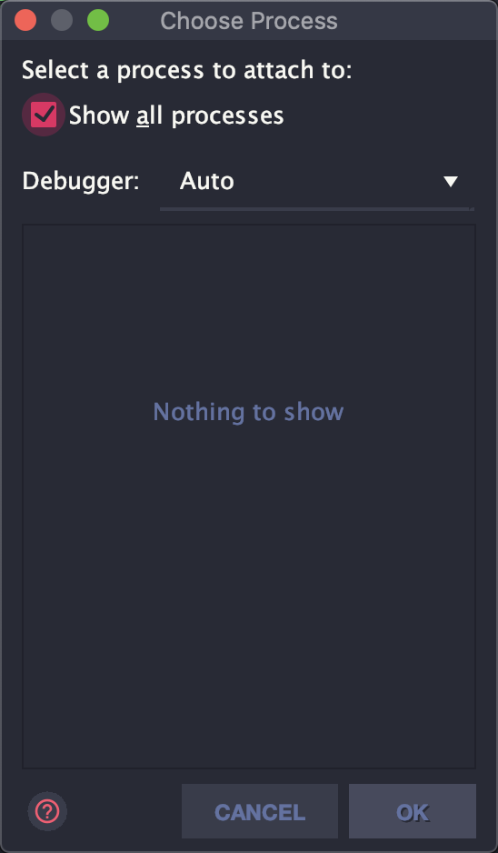
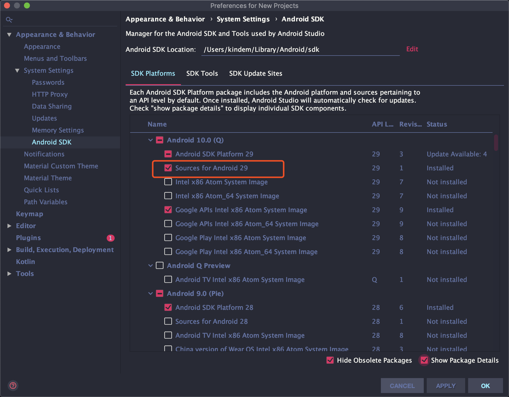
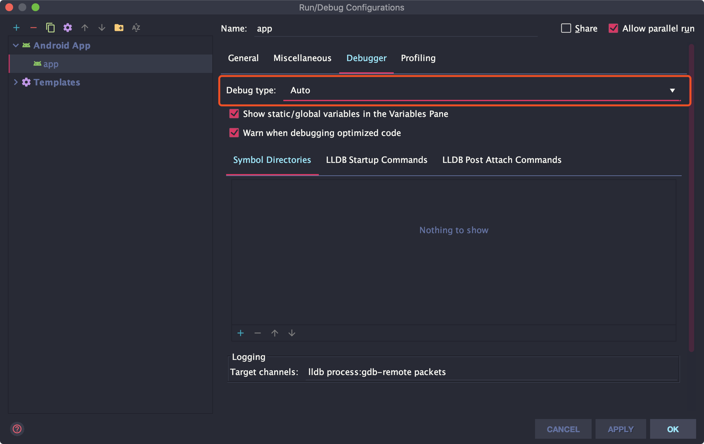

<!--
@key 21
@title Android 调试技巧总结
@date 2019-12-30
@labels Android Test Tips
@description Android 奇淫调试技巧总结，包括 Attach、waitForDebugger、setup-debug-app、NDK 调试、Android SDK 源码调试等。
-->

在 `Android Studio` 中，最基本的以 `debug` 模式运行程序并打断点进行调试，相比大家都会，不过，如果遇到一些特殊的调试场景，则需要运用一些特殊的调试技巧来进行调试。

# 🍗 在程序运行之后打断点调试

有时候，我们需要对已经运行的程序进行调试，这时候应该使用 `Android Studio` 的 `Attach` 功能：


点击工具栏中的 `Attach Debugger to Android Process` 按钮，会显示出可以 `Attach` 的进程：



如果未勾选 `Show All Processes` 选项，则只会显示当前项目对应的进程，勾选 `Show All Processes` 选项之后，则会显示当前机器上跑着的所有进程（需要 `root` 权限）。

在调试之前先打好断点，然后在这里选择目标进程之后，即可成功断上。

# 🍥 等待调试

在某些场景下，部分代码可能在程序一启动就执行完了，这种情况下，可以使用 **“等待调试”** 功能来让程序暂时停住，等待调试器 `Attach` 之后再开始执行。

第一种方法是直接在代码中添加：

```java
import android.os.Debug;

// .....
Debug.waitingForDebugger();
```

编译运行后，当代码执行到这一句话之后，便会显示 `Wait For Debugger` 字样并且暂停执行，等待用户手动 `Attach` 之后才会接着执行，此时，就能断住之前执行太快断不住的代码进行调试了。

另外一种方法是使用 `adb` 指令：

```shell
adb shell am set-debug-app -w <packageName>
```

来设置待调试应用，设置了这一条语句之后启动对应应用之后则会停住，等待调试器 `Attach`，这种方法的好处是可以不用修改代码就让应用等待调试。

# 🧀 调试 Android SDK 源码

在一些特殊的场景，需要调试 `Android SDK` 源码中产生的异常，通过 `Android SDK` 源码中产生的现象发现自己写的代码逻辑的问题。

这种情况下，需要使用原生 `Android ROM` 来进行调试，因为通常来说，第三方产商自己的 `ROM` 都进行了不同程度的定制，一般第三方 `ROM` 的字节码都与 `Android Studio` 提供的 `SDK` 源码行号对应不上，导致无法调试。最简单的方法，就是使用模拟器进行调试，因为模拟器的 `ROM` 是官方提供的 `AOSP` 系统，行号能够对应。

另外一点需要注意的是，如果需要调试 `Android SDK` 源码，需要保证 `build.gralde` 中配置的 `minSdkVersion` 与系统的版本相对应，如果临时需要调试 `Android SDK` 源码，可以先将 `build.gradle` 中的 `minSdkVersion` 调整到目标版本，完成调试之后再改回来。

另外，调试某个版本的 `Android SDK` 源码，需要先下载源码，然后通过 `IDE` 的跳转功能进入源码，然后就像对普通正常代码一样进行调试即可：



# 🍙 调试 NDK 代码

调试 `NDK` 代码其实与调试 `Java` 代码一样，只需要在调试前将 `Run Configuration` 中的 `Debugger` 标签页中的 `Debug Type` 一栏修改为 `Auto` 或者 `Native` 即可：



完成修改后像对普通代码一样调试即可。