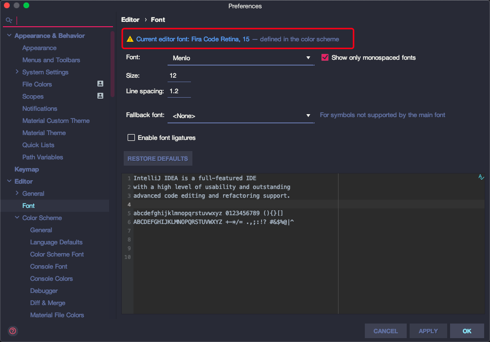

<!--
@key 25
@title 个人 JetBrain IDE 配色及字体分享
@date 2020-4-4
@labels Share Tips
@description 使用 Material Theme UI 以及 Fira Code 字体打造最美 JetBrain IDE
-->

# 🍙 整体图

话不多说，先上一张图：

# 🍳 使用到的东东

* `Material Theme UI`：一款 `JetBrain` 系列 `IDE` 可以使用的主题插件，里面内置了很多配色，可以自选。
* `Fira Code`：一款好看的等宽连体字体。

# 🍔 配置

`JetBrain` 家的 `IDE` 都可以按照这个方式配置，如 `IDEA`、`PyCharm`、`Android Studio`、`CLion` 等。这里以 `IDEA` 为例：

首先下载 `Fira Code` 字体：[Fira Code - Github](https://github.com/tonsky/FiraCode)，点击图示按钮下载字体包：

下载完成字体包后自行字体即可。

安装完字体后进入 `IDE` 设置，点击 `Plugins` 选项页，在搜索栏中输入 `Material Theme UI`，安装对应的插件，如下图：

安装完成之后需要重启 `IDE`，重启之后会进入一个欢迎页，便于你快速配置主题等，我们可以直接跳过，因为之后可以在设置里面手动配置。

进入设置，搜索 `material`，进入图中的选项页，可以选择一些插件自带的配色：

我最喜欢 `Dracula`，当然 `One Dark Pro`、`Monokai Pro` 等都是很不错的主题，可以根据自己喜欢来选择。

配置完主题之后需要配置字体，在设置中搜索 `font`，找到图中的页面，但是先不要配置，点击图中的链接，进入 `Color Scheme Font` 的字体配置界面：

点击链接后会进入下图的界面，这时候做真正的配置：

这里推荐配置 `Font` 为 `Fira Code Retina`，`Fallback Font` 为 `Fira Code`，字号的话 `MacOS` 为 `15`，`Windows` 为 `14`，行高 `1.0`，并且开启连体字功能。

到这里就完成了配置，分享出来给大家，喜欢大家能喜欢。