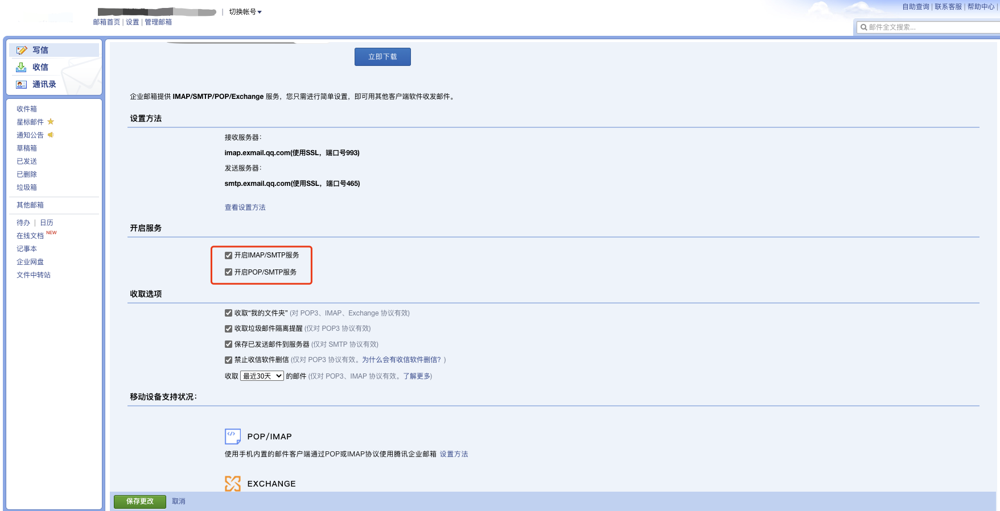
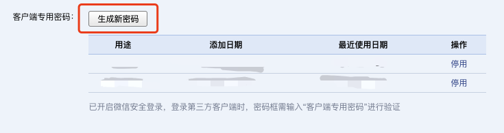
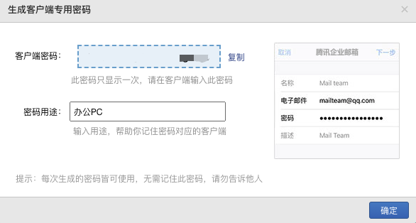
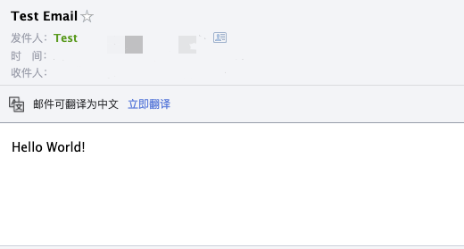

<!--
@key 30
@title 使用 Emailjs 发送邮件
@date 2021-1-14
@labels Node.js JavaScript
@description Emailjs 是一个不错的 Node.js SMTP 客户端，可以使用它来完成邮件的自动发送，本文将介绍如何使用 Emailjs。
-->

# 💡 背景

突然需要一个后端发送邮箱验证码的功能，我使用的后端框架是基于 `Node.js` 搭建的，所以准备找一个合适的能够调用 `SMTP` 服务发送邮件的轮子。

一番寻找之后，我找到了 [emailjs](https://github.com/eleith/emailjs)，下面简单介绍一下用法。

# 📦 安装

最经典的 `npm/yarn` 安装：

```shell
# Yarn
yarn add emailjs

# Npm
npm install emailjs
```

# 📮 配置邮箱

接下来需要一个可以使用的邮箱账户，因为我不准备以个人邮箱发送验证码，我使用了免费的 [腾讯企业邮箱](https://exmail.qq.com/login)，注册了一个企业账户，当然你可以使用任意支持 `SMTP` 服务的邮箱。

接下来需要在邮箱后台配置开启 `SMTP` 服务：



有一些邮箱对于三方客户端采取了高级的安全登录策略，不允许直接使用密码登录，而是使用 `token`，腾讯企业邮箱就采取了这样的方案：



这时候我们需要生成一个新的 `token` 用于 `emailjs` 使用 `SMTP` 服务：



复制客户端密码，准备使用 `emailjs` 发送邮件。

# 🎯 Emailjs 使用

`emailjs` 是基于 `SMTP` 服务发送邮件的，我们需要先查询对应邮箱服务器的 `SMTP` 服务端口与地址，腾讯企业邮箱有一个 [配置指南](https://work.weixin.qq.com/help?person_id=0&doc_id=423&helpType=exmail)，通过配置指南我们可以得到以下信息：

* `SMTP` 发送服务器地址：`smtp.exmail.qq.com`
* 端口号：`465`
* `SSL`：开启

接下来编写 `Node.js` 代码：

```js
const { SMTPClient } = require('emailjs');

const client = new SMTPClient({
    user: `${senderEmail}`,
    password: `${password}`,
    host: 'smtp.exmail.qq.com',
    port: 465,
    ssl: true
});

(async function () {
    try {
        await client.sendAsync({
            text: 'Hello World!',
            from: `${senderName} <${senderEmail}>`,
            to: `${receiverEmail}`,
            subject: 'Test Email'
        });
    } catch (e) {
        console.log(e);
    }
})();
```

其中你需要替换这些变量：

* `${senderName}`：你想展示的笔名
* `${senderEmail}`：你的发送邮箱
* `${password}`：上一节申请的登录 `token` 或邮箱密码
* `${receiverEmail}`：接收者邮箱

接下来登录接收者邮箱，即可看到邮件发送成功：



如果想了解更详细的用法，可以在 `github` 上查看 [emailjs](https://github.com/eleith/emailjs) 更详细的文档。
