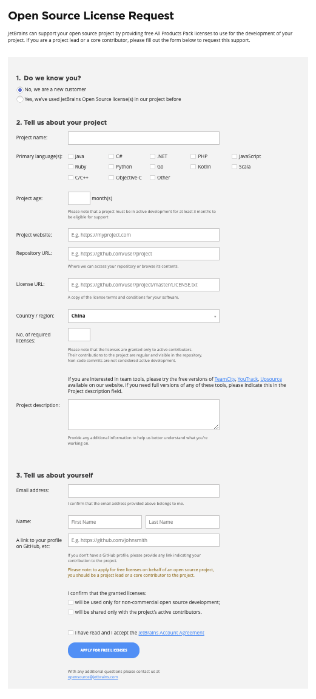

<!--
@key 31
@title JetBrains 激活黑科技 - Open Source License
@date 2021-1-19
@labels JetBrains Tips
@description 咱直接告别盗版，使用黑科技入正！
-->

# 💡 背景

随着 `JetBrains` 查水表越来越严，各种 `License Server`、激活码都不管用了，而我是重度 `JetBrains` 用户，离开 `JetBrains` 系列 `IDE` 直接寸步难行。俗话说的好：“早买早享受，晚买免费送。”我可一定要找一个能让 `JetBrains` 官方送我 `License` 的方法。

经过一番寻找之后，我发现了 [JetBrains Open Source Project](https://www.jetbrains.com/opensource/)，看页面最底端：

简单来说就是只要你是一个符合条件的开源项目贡献者，你就可以获得免费的 `License`。

# 🍙 申请 Open Source License

进入 [Open Source License](https://www.jetbrains.com/community/opensource/#support) 页面：

可以看见，对项目的要求有：

* 满足开源项目的定义
* 项目启动至少三个月，并且三个月内必须有积极的提交
* 项目正在积极开发中
* 项目不能从属于商业公司或组织
* 项目不能提供商业服务

对申请人的要求有：
* 不能贿赂项目的核心开发者
* 是项目的创建者或者核心贡献者
* 只能使用 `License` 开发非商业项目
* 不能分享 `License`

`License` 的有效期为一年，一年后可以酌情延长。我们可以进入 [Open Source License Request](https://www.jetbrains.com/shop/eform/opensource) 页面开始填写申请：

需要填写的内容有：

* 项目名
* 项目使用的语言
* 项目年限
* 项目主页
* 项目仓库地址
* 项目 `License` 地址
* 国家 / 地区
* 申请 `License` 数量
* 项目描述（小作文）
* 邮箱
* 姓名
* `GitHub` 主页

填写完成之后提交即可，一到两周后 `JetBrains` 会发送邮件告知申请结果。

# 🍤 喜提 License

我申请时使用的项目是我个人的新博客项目 [blog-v4](https://github.com/FlyAndNotDown/blog-v4)，申请后一周即收到了 `JetBrains` 的回信：

激活后即可使用 `JetBrains` 旗下任意产品：

可以看到 `License` 上还标注了申请的项目和申请人，非常 `Nice`，`License` 使用期为一年。当然，`JetBrains` 官方还是希望使用者也给他们打一波广告的，于是我在项目的 `README.md` 中加入了 `JetBrains` 的赞助信息。

到这里 `Open Source License` 的申请就结束了，最后还是希望大家多多支持正版，毕竟 `JetBrains` 为我们提供了这么优秀的工具，真的不容易。
