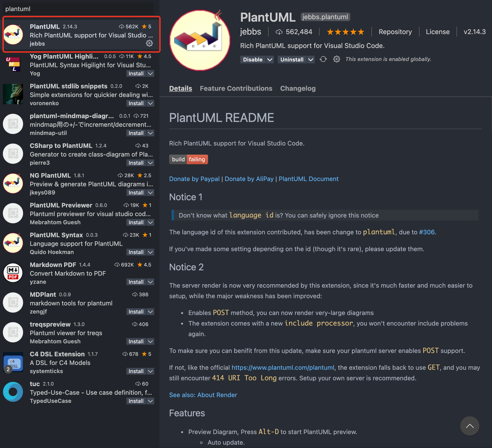
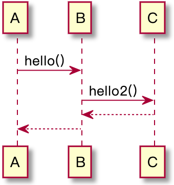

<!--
@key 32
@title 使用 PlantUML 享受流式绘图
@date 2021-2-10
@labels Tools Tips
@description PlantUML 是一款优秀的 UML 图绘制工具，PlantUML 的存在意义类似于 Markdown，可以流式描述 UML 图。
-->

# PlantUML 介绍

PlantUML 是一款优秀的 UML 图绘制工具，使用它可以方便快捷地绘制 UML 图。我个人认为它的存在意义与 Markdown 非常相似，Markdown 的功能是流式描述文档，而 PlantUML 的功能是流式描述 UML 图，用户只需要把精力放在 UML 图的描述上，而无需关心排版。

PlantUML 使用 Graphviz 作为 绘图引擎，通过 PlantUML 语言来构建 UML 图逻辑，稍后我们将做详细介绍。

# PlantUML 绘图环境搭建

首先，我们需要安装绘图引擎 Graphviz，官网在这：[Graphviz](https://www.graphviz.org/download/)，可以选择源码编译或者二进制包，我自己使用的操作系统是 MacOS，所以这里直接使用 brew 工具安装：

```shell
brew install graphviz
```

完成安装后，我们来搭建 PlantUML 环境，PlantUML 官方针对不同的编辑器提供了不同的插件，我自己使用的是 Visual Studio Code，在扩展中寻找 PlantUML 并安装即可：



到这里 PlantUML 绘图环境的搭建就完成了。

# 开始绘图

PlantUML 官方的语法说明在这：[PlantUML](https://plantuml.com/zh/)，支持的 UML 图种类有很多，这里以序列图为例，给一个简单的例子：

```
@startuml
A -> B : hello()
B -> C : hello2()
B <-- C
A <-- B
@enduml
```

新建一个文件并在其中贴上上面这段，敲 `Ctrl + Shift + P` (MacOS 用户是 `Command + Shift + P`)，然后键入 `PlantUML`，选择 `Preview Current Diagram` 项并回车，就可以看到 UML 图效果了：



其他的 UML 图也类似，快去官网学习一下语法，然后体验极速绘图的快乐吧。
