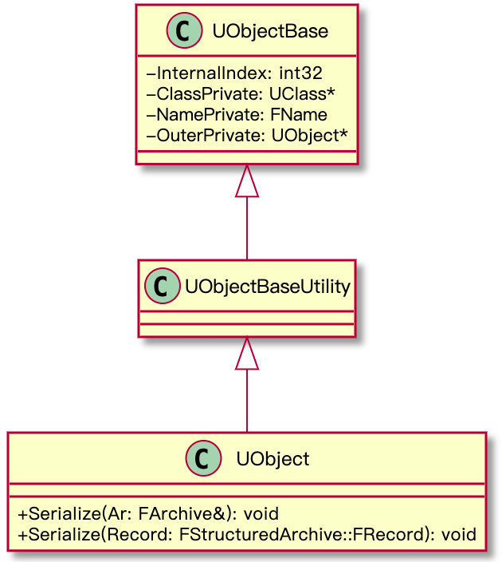

<!--
@key 33
@title UnrealEngine4 源码剖析 | (一) UObject 系统
@date 2021-2-10
@labels Unreal
@description UObject 系统是 Unreal Runtime 的核心，其负责了三大功能：反射、序列化、GC。
-->

最近在读 UnrealEngine4 源码，读了一些代码后有不少心得体会。网上关于 UnrealEngine4 源码的资料其实并不是，而且大多数文章说的都是一知半解，不够通俗易懂，所以就想着把自己的新的体会和读代码中踩过的坑记录下来，帮助大家避雷。

我准备把我个人的 UnrealEngine4 源码阅读笔记作为一个专题分享给大家，专题将会涵盖到引擎源码主要、最重要的部分，带大家深入了解 UE4，这篇文章是系列的首篇，将会带大家认识 UE4 的 UObject 系统，并带大家了解 UObject 系统在 UE4 中的意义。

---

# 1. 开始读源码前你需要掌握的知识

## 1.1 自省、反射

我们先来看一下 Java 中的反射机制定义：

> Java 反射机制是在运行状态中，对于任意一个类，都能够知道这个类的所有属性和方法；对于任意一个对象，都能够调用它的任意方法和属性。

定义的前半句即自省，而后半句即反射。使用 UE4 的朋友应该大多数都是 C++ 开发者，但是如果大家使用过一些 C++ 之外的现代语言，就会明白自省和反射的重要性。

自省与反射的用途非常广泛，比如很多语言（如 Python）的命令行脚本解释器、对象的自动序列化（通过自省遍历属性并依次序列化）、QT 的信号槽等，都是基于自省与反射实现的。

仔细想一想，其实要实现语言层面的自省与反射，是很简单的，只需要在编译字节码 / 二进制的时候额外写入类、属性、方法的类型信息即可。但是 C++ 由于年龄实在太大，在设计之初并没有考虑如此基础的功能，以至于到现在为止，C++ 也没在标准中提供自省与反射的语言支持。

但是人们的智慧是无穷无尽的，很多使用 C++ 构建的软件都会选择自己实现一套反射系统。目前已知的套路有两种：

1. 手动注册类型信息
2. 预编译器生成类型信息

手动注册类型信息就显得很简单粗暴了，这里有一个有名的库，叫做 [rttr](https://github.com/rttrorg/rttr)，上一段代码，你就秒懂他的原理了：

```cpp
#include <rttr/registration>
using namespace rttr;

struct MyStruct {
    MyStruct() {};
    
    void func(double) {};
    int data;
};

RTTR_REGISTRATION
{
    registration::class_<MyStruct>("MyStruct")
         .constructor<>()
         .property("data", &MyStruct::data)
         .method("func", &MyStruct::func);
}
```

这里使用 rttr 库注册了一个名为 MyStruct 的结构体，代码很简单，就是在一个静态块中手动注册了 MyStruct 的属性与方法。在完成注册之后，就可以开始经典的反射操作了，如遍历属性：

```cpp
type t = type::get<MyStruct>();
for (auto& prop : t.get_properties())
    std::cout << "name: " << prop.get_name();

for (auto& meth : t.get_methods())
    std::cout << "name: " << meth.get_name();
```

这种方法相当简单，但是问题也很明显，设想如果我写了一个类但是忘了写注册代码，岂不是裂开？另外，我也不能改一下类定义又立马去比对差异然后把类型信息也加上吧。所以相比于上面这种原始而粗暴的方法，**预编译器** 生成类型信息往往更得到大项目的青睐。

著名的 C++ 跨平台 GUI 框架 QT 使用的则是这种方法，先看一段 QT 的代码：

```cpp
class SampleWidget : QWidget 
{
    Q_OBJECT
    ...
}
```

QT 有一个自己的预编译器，叫做 MOC，在源码输入编译器之前，会先经过 `MOC` 处理一遍，`Q_OBJECT` 是一个空宏，它的作用很简单，就是告诉 MOC 分析头文件中的类、属性、方法的类型信息，然后生成对应的宏展开，再把这些额外生成的宏展开一起丢进编译器编译，最后全自动生成类型信息，这样就可以使用反射系统了，具体的原理大家可以自己去了解一下。

当然 UE4 使用的也是预编译器生成类型信息的方案，UE4 的预编译叫 UHT (Unreal Header Tool)，我们后面会做一期专题详细聊聊它。读 UObject 的源码，了解到这里就够了。

## 1.2 垃圾回收

垃圾回收 (GC) 的概念大家应该都很熟悉了，垃圾回收简单来说就是由语言 / 框架自动管理内存，使用一些高级的识别手段（如引用计数、根搜索法等）来寻找没有再被使用的内存并自动释放。

C++ 没有内置 GC 功能，所有 `new` 出来的对象都需要用户手动 `delete` 来释放，当然，C++ 也有一些进阶的内存管理手段，如所有权消失自动释放内存的 `unique_ptr` 和引用计数为 0 自动释放内存的 `shared_ptr`，但是相比起 GC 那种完全傻瓜式的内存管理，还是略显愚蠢。

GC 通常来说是语言虚拟机的活，但是由于 C++ 没有 VM，纯靠编译，大多数框架都会选择使用一种折中的方法来实现 GC，可以认为是把 GC 功能从 VM 中抽离出来跟自己的系统合并在一起使用。

UE4 当然也是这样，具体来说是不允许用户使用 `new` 操作符来创建对象，而要使用它提供的 `NewObject` 方法，然后通过一张全局对象表管控所有藉由 `NewObject` 方法创建的对象，最后通过 GC 线程 + 锁，不断 Stop The World（停止所有非 GC 线程）来标记、回收无用对象，我们下面会详细剖析 GC 过程。

# 2. UObject

在 UE4 中，所有游戏线程的对象都会继承自 `UObject` 类，`UObject` 类提供了三大功能：

1. 自省与反射
2. GC
3. 序列化

序列化由于跟 UPackage、UAssets 挂钩，我会在下一节中统一分析，本篇将着墨讲自省反射与 GC。

`UObject` 的代码在 /Source/Runtime/CoreUObject/Public/UObject/UObject.h，先来看看 UObject 的继承关系：



其中，`UObjectBase` 提供了四个核心属性：

* `InternalIndex`：对象在全局表中的唯一索引
* `ClassPrivate`：对象的 UClass 类型
* `NamePrivate`：对象名，也是全局唯一
* `OuterPrivate`：对象所属的 Outer 对象，即对象所在的 UPackage

`UObjectBaseUtility` 没有额外属性，提供了一系列引擎内部使用的方法，我们不必太关心。

`UObject` 扩展出了一些生命周期方法，以及最重要的序列化方法 `Serialize()`，调用 `UObject#Serialize()` 即可完成对象的序列化或反序列化。

另外全局对象表代码在 /Source/Runtime/CoreUObject/Private/UObject/UObjectHash.cpp，进入文件我们可以找到两个关键类：

* `FUObjectArray`
* `FUObjectHashTables`

可以理解 `FUObjectArray` 是一个全局指针数组，存储了所有使用 `NewObject` 创建的对象。而 `FUObjectHashTables` 记录了对象间的各种关系，在 GC 销毁对象时，会释放 `FUObjectArray` 中的内存和 `FUObjectHashTables` 的对象关系。

# 3. UField、类型系统及反射

<!-- TODO -->

# 4. 全局对象表与 GC

<!-- TODO -->
