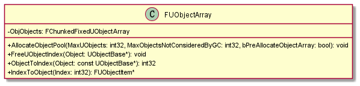
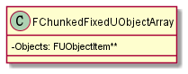
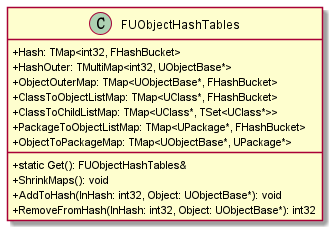
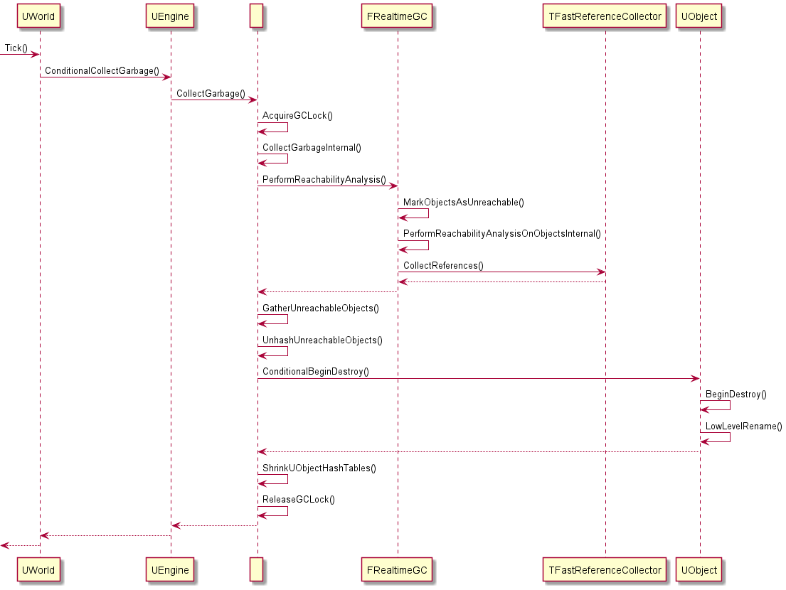

<!--
@key 34
@title UnrealEngine4 源码剖析 | (二) 垃圾回收
@date 2021-2-16
@labels Unreal
@description 垃圾回收功能可以说是现代语言的标配，而 UnrealEngine4 在 Runtime 中实现了垃圾回收，扩展了 C++，大大降低了使用者的入门门槛。
-->

# 1. 垃圾回收

垃圾回收（ GC ）可以说是现代编程语言的标配，GC 简单来说就是语言运行时自动判别申请的内存是否还在被使用，判断内存无用后则自动回收内存。内存管理从来就不是什么容易事，需要手动管理内存实际上也是 C/C++ 入门门槛高的一大原因，稍有不慎就会造成内存泄露。

UnrealEngine4 在自己的 Runtime 中实现了 GC 功能，所有使用 `NewObject()` 或 `LoadObject()` 方法创建的对象都会受 GC 系统的管制，当对象无用后将会自动释放。

# 2. UE4 GC 源码阅读

首先我们要知道，在 UE4 中，是不能通过 C++ 内置的操作符 `new` 来创建对象的，使用 `new` 创建的对象将不受 UE4 Runtime 的控制，正确的做法是使用 `NewObject()` 或者 `LoadObject()` 方法创建或加载对象。

首先我们需要知道，当使用 `NewObject()` 创建对象后，真正的内存将会被保存至一个全局数组中，另外还需要在一个全局 Hash 表中保存一些其他信息，这部分代码在 /Engine/Source/Runtime/CoreUObject/Private/UObject/UObjectHash.cpp，我们需要关注两个关键信息：

```cpp
FUObjectArray GUObjectArray;

class FUObjectHashTables {
    // ...

    static FUObjectHashTables& Get()
	{
		static FUObjectHashTables Singleton;
		return Singleton;
	}
}
```

其中 `GUObjectArray` 就是全局对象数组，而 `FUObjectHashTables` 是一个单例，类内部维护了几张 Hash 表，存储了对象之间的关系。我们先看 `GUObjectArray`，它的类型是 `FUObjectArray`：



可以看到内部封装了一个 `FChunkedFixedUObjectArray`，然后提供了一些 Index 与 对象之间转换的工具方法，我们再接着看 `FChunkedFixedUObjectArray`：



`Objects` 就是真正申请的内存了，通过 `NewObject()` 创建的对象都会保存在指针数组中。接下来我们看 `FUObjectHashTables`：



不用多少，内部保存了很多张 Hash 表来存储对象之间的关系，然后提供了摇树压缩和 Hash 表相关操作的方法。

接下来，我们来看 GC 的整体流程，GC 的起点是 `UWorld#Tick()`，可以顺着我给的时序图来梳理整个流程：



在 `UWorld#Tick()` 中会调用 `UEngine#ConditionalCollectGarbage()` 来开始垃圾收集，其中又会调用全局方法 `CollectGarbage()`，其中会先获取全局锁，暂停主线程以外的所有线程，即 GC 中常见的 "**Stop The World**" 操作，此时主线程会完全被 GC 工作占用，其他线程被锁停止。

开始 GC 后，会调用 `FRealTimeGC#PerformReachabilityAnalysis()` 方法来进行对象可达性分析，UE4 使用的 GC 算法是 "**标记-清除**" ，从后面调用的 `MarkObjectsAsUnreachable()` 和 `CollectReferences()` 也能看出端倪。

在完成对象标记后，会调用 `GatherUnreachableObjects()` 方法来收集所有不可达的对象，并将其保存在一个临时数组中，之后会调用 `UnhashUnreachableObjects()` 方法来销毁所有不可达的对象，这一步中会调用到 `UObject` 的生命周期 `BeginDestroy()`，在基类的实现中有具体的销毁流程。

最后调用 `ShrinkUObjectHashTables()` 方法针对全局 Hash 表 `FUObjectHashTables` 进行摇树压缩，完成后释放 GC 锁，这样就完成了一轮 GC 的所有流程。
