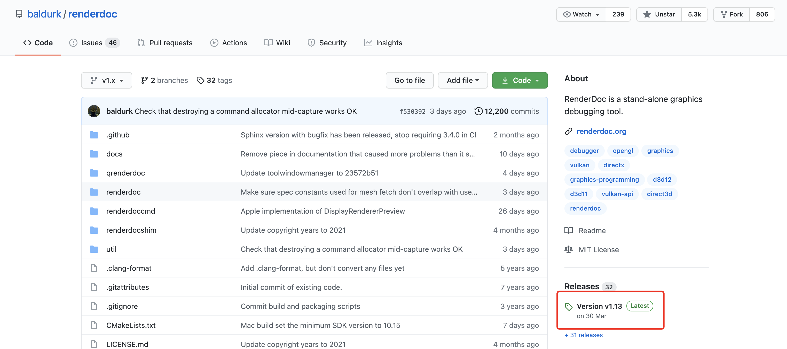
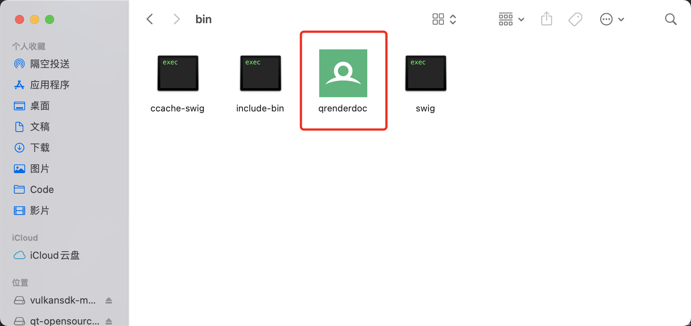
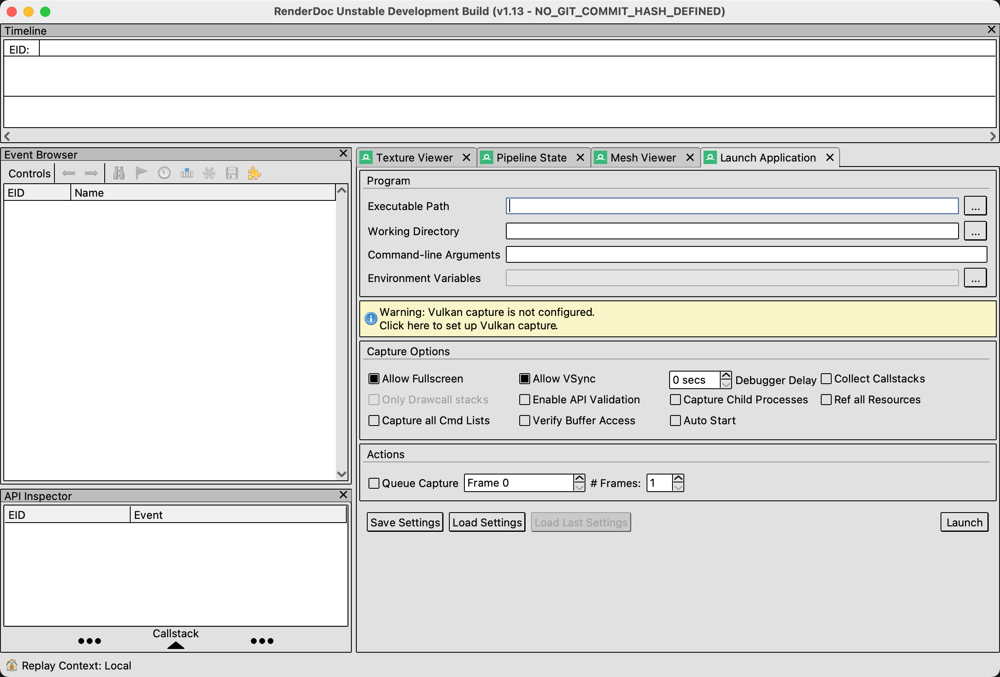

<!--
@key 36
@title MacOS 编译 RenderDoc
@date 2021-5-3
@labels MacOS RenderDoc
@description RenderDoc 是一款强大的图形调试软件，可以说没有它图形调试基本寸步难行，然而作者说对 MacOS 不太熟悉，所以基本对 MacOS 弃疗了，我们只能自己尝试能不能编译使用起来。
-->

# 安装依赖

需要安装的依赖如下：

* autoconf
* automake
* Qt5

其中 Qt5 是 RenderDoc 的界面库，autoconf 和 automake 在构建 c 胶水层生成工具 swig 会使用到。

我们可以直接使用 brew 依次安装所有依赖：

```shell
brew install autoconf
brew install automake
brew install qt5
```

完成安装后，还需要配置一下 Qt5 的 bin 目录到 PATH 中：

```shell
export PATH="/usr/local/opt/qt@5/bin:$PATH"
```

# 编译 RenderDoc

首先下载源码，可以直接去 github 下载最新的 release 版本：[GitHub - RenderDoc](https://github.com/baldurk/renderdoc)：



下载完成后解压：

```shell
tar -xvf renderdoc-1.13.tar.gz
```

完成后进入 RenderDoc 源码目录使用 CMake 开始构建：

```shell
cd renderdoc-1.13
mkdir build
cd build
cmake ..
cmake --build . -j 16
```

建议构建时开启 VPN，因为会去墙外下载他们修改过的 swig 源码并当场构建，网络不好可能会构建失败。

# 运行

完成构建后可以在 `build/bin` 目录下找到构建完成的 RenderDoc App：



运行即可：


