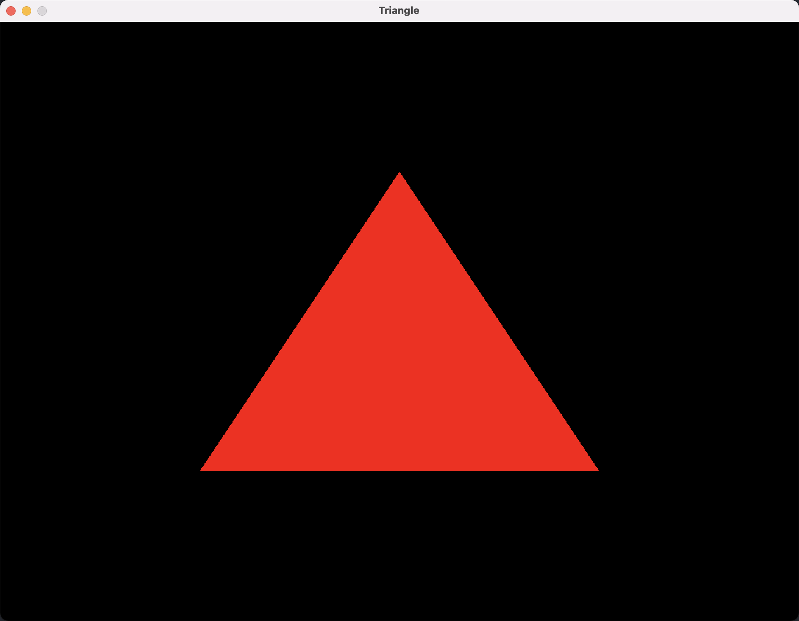
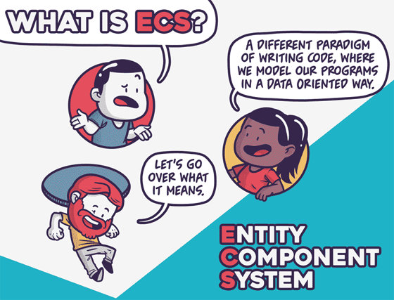
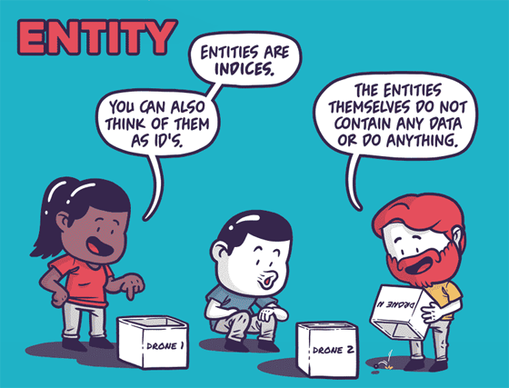
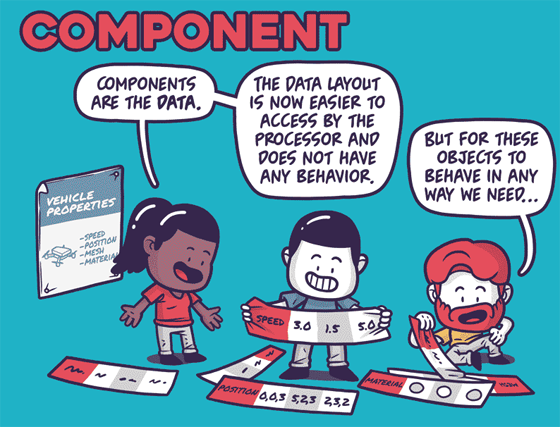
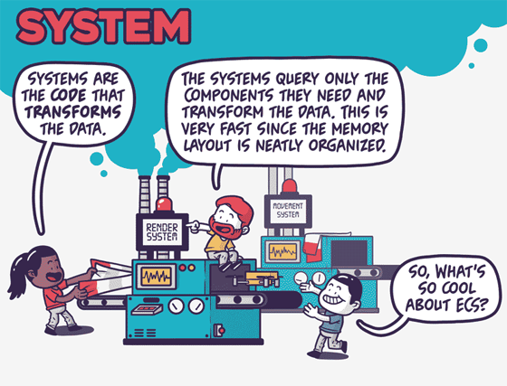

<!--
@key 37
@title Explosion 开发笔记 (二)
@date 2021-5-4
@labels Explosion
@description 我和 Explosion 游戏引擎那些事
-->

# 第一个三角形！

先说说近期的进展吧，最大头的成果就是趁着五一假期把 VulkanDriver 基本写完了，经典三角形：



基本的接口封的差不多了，后面的小问题再慢慢修修补补吧。

然后就是工程建设方面的，差不多这段时间把这些东西搞起来了：

* CI (GitHub Action)
* 三方库 Git SubModule 支持
* README / WiKi

单元测试框架本来想加上，但想到目前也只有 Driver，没什么写 UT 的必要性，想想也就算了，等到后面慢慢有需要再加吧，反正集成 UT 框架也就是几行 CMake 的事情。

接下来要做的是 RPI、Runtime、场景管理等，还得把预置的 Components、Systems 给加上，总之好好加油吧。

# 不省心的 RHI
RHI 是写引擎绕不开的巨坑，时常想吐槽这么多 API，你们相互之间打一架好不好，这么多年了也一直搞不出一个统一的 API，各个平台都想围绕自己打造封闭的生态。

写 RHI 最难的事情就是要拿一套统一的接口去封装多个图形 API，于是乎割舍功能和删删改改变成了常态，称 RHI 为脏活累活一点不过分。对各个 API 的了解程度将直接决定 RHI 最终接口的实用程度。

别的很多东西其实可以借鉴老哥们，但是针对 RHI 这层来说，老大哥们的封装其实也不咋地，因为以前的 API 粒度毕竟是较 High Level 的（如 OpenGL、DX9 一类的），很多情况下无法发挥完全能效，再或者看看 CryEngine，索性直接 typedef 实现多态，硬生生把 RHI 和 RPI 糊在一起，只要我没有 RHI，最不存在烦恼，嗯，没毛病。

之前也听同事吐槽过，自己造引擎如果从底层开始写，写到最后发现自己删了好几遍代码，写来写去最后还是一个三角形，上面的啥也没写。

我目前的想法是先按照 Vulkan 的概念简单封装后搭建 Driver 的公共接口，这样上面的 RPI 和游戏逻辑框架也可以先写起来了，日后再慢慢补充 DX12Driver 和 MetalDriver。

目前 VulkanDriver 封装的概念如下：

* Driver
* Device
* SwapChain
* Image
* ImageView
* Texture
* RenderPass
* FrameBuffer
* Pipeline
* GpuBuffer
* CommandBuffer
* CommandEncoder
* Signal
* Fence

基本涵盖了 Vulkan 的大部分概念，实现的过程中发现主要是 Enum 的转换与 Flags 的处理比较恶心，而且日后这部分在其他 Driver 的兼容性上估计也会出岔子，我目前的想法是尽量使用继承和多态将复杂的 Flags 组合给完全屏蔽掉，来提高兼容性。

目前 VulkanDriver 已经基本实现完全了，争取不再往上面放太多精力，先关注上面那些没做的东西，等到 DX12 和 Metal 也添加进来后，再慢慢开始写 RHI 线程管理、内存管理、 CommandQueue 一类的功能。

# ECS, 曙光还是末日?

介绍 ECS 前，我们先简单回顾下传统的 GameObject 游戏编程范式，在 GameObject 的世界里，游戏对象被称为 GameObject，而 Component 被称为组件，组件是**承载数据和逻辑**的单位，一个 GameObject 可以挂载各种 Component 来实现不同的功能。

像这样：

```
Player
|- TransformComponent
|- PhysicsComponent
|- ScriptComponent
```

脚本系统中往往会给一些生命周期方法和一些工具方法，来给开发者提供控制 GameObject 的能力，比如实现一个自转的功能你需要这么写（伪代码）：

```
public float SPEED = 1.f;

void onStart()
{
    // ...
}

void onUpdate(float deltaTime)
{
    this.getComponent<Transform>().rotate(Vector3.UP, deltaTime * SPEED);
}
```

可以看见之所以我说 GameObject 既承载数据，又承载逻辑，是因为多数引擎把脚本本身也作为了一种 Component，由此产生了无穷的变化，数据流变得不可预测，难以控制。

但是很明显，老朋友 GameObject 的有点在于好用，我甚至可以在任意 GameObject 上挂载一个脚本，然后用这个脚本去影响 World 中的一分一毫，基本可以说是毫无规则可言。

由此，大厂们提出了一种更为先进的编程范式，称之为 ECS，关于介绍可以看 Unity 的介绍：[Unity - ECS](https://docs.unity3d.com/Packages/com.unity.entities@0.17/index.html)，Unity 画了几张漫画来介绍 ECS，我认为非常生动形象：









概念如下：

* Entity：实体，只是一个 Id，不保存任何数据，也没有任何逻辑
* Component：组件，是数据的集合，不存储逻辑，数据排布按照高效的内存访问方式设计
* System：系统，是处理数据的逻辑，每一个系统只处理自己所关心（订阅）的组件，多数情况下系统之间还能并发

这样有什么好处呢？

其实可以很明显的看出来，Component 可以以一种高效的方式存储，所有类似的 Component 可以存在相邻的内存空间中，这样当 System 去尝试遍历一种类型的 Component 并处理时，大部分的 Component 都会被 Cache 在 CPU 的 LN Cache 中，大大地提高速度（当然不光这一种内存管理方法，比如 Unity 采用的方法是所有具有相同 ArcheType 的 Entity 的 Components 按照顺序存放）。

再加上每个 System 只关心自己所订阅的 Components，这样一来没有依赖的 System 之间本身可以并发，可以把 CPU 多核的能力利用起来，这也是以往的游戏引擎正欠缺的，因为多数情况下，脚本如果并发可能会导致很多问题。

所以，“快”，就是 ECS 最大的优势。

如果使用 ECS 的方法来改造章节开头的例子，那就会变成这样：

```
PlayerEntity
|- RotateComponent

struct RotateComponent {
    float speed;
};

class RotateSystem {
    void onUpdate(float deltaTime, Registry registry) {
        let view = registry.view<RotateComponent, TransformComponent>();
        view.forEach((entity, rotateComp, tranComp) -> {
            Math.rotate(tranComp, Vector3.UP, deltaTime * rotateComp.speed);
        });
    }
};
```

写起来明显变得更操蛋了，这也是 ECS 一直被诟病的地方，学习成本高、难用，而且由于 Component、System 完全可以交由用户自定义，有时候写着写着会违背原则，产生一些垃圾代码，所以 ECS 推广了这么多年了也一直没真正地流行起来。

回到标题，我写的标题叫做 “ECS，曙光还是末日？” 我指的其实是对开发者来说的，从正面看，ECS 是明显的数据驱动范式，能够把数据和逻辑完全解耦，从长远来看是能提高工程的质量的，而且加上正确操作下 ECS 确确实实能提高 CPU 这边逻辑的运行速度。但是从反面来看，使用 ECS 从编程思维上就完全升维了，很多开发者很难适应，就算适应了，要写出来高质量的代码，还需要一定的学习成本，所以说，ECS 能带来曙光，也完全能带来末日。

我自己是忠实的 ECS 拥趸，我的观念中，ECS 带来的利是远远大于弊的，速度是一方面，我认为更重要的是 ECS 那种数据驱动、数据 / 逻辑分离的思想，对提高工程中代码质量、降低维护成本都是很有帮助的。

总而言之，期待 ECS 之后的发展，也期待 Explosion 与 ECS 碰撞出奇妙的火花。
